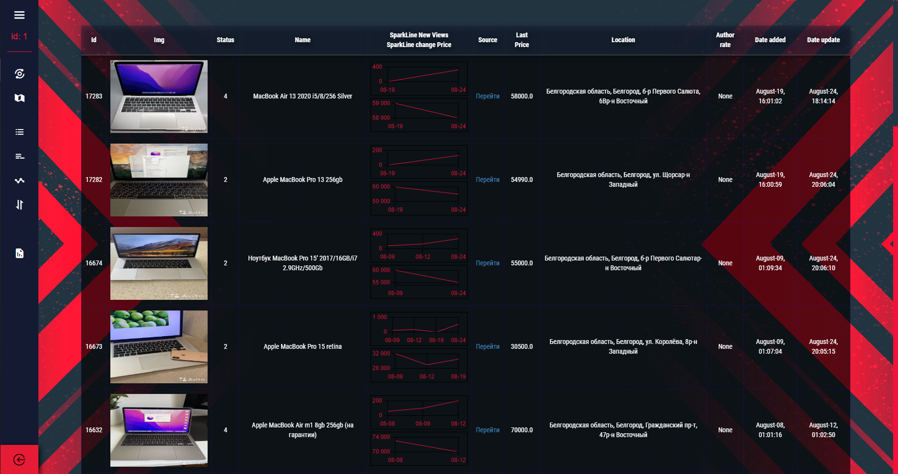
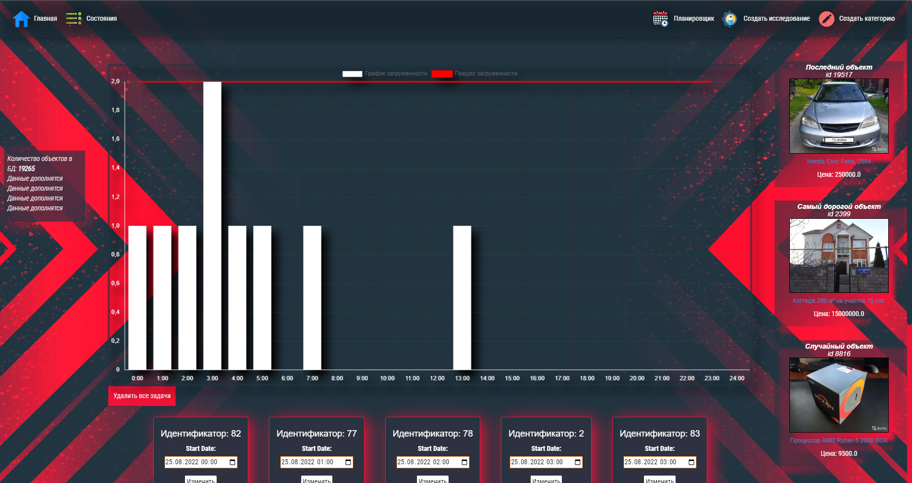

Проект системы мониторинга объявлений 
=====================

***
Основное назначение проекта - обеспечение более подробной и углубленной информации об объектах продаж и услуг 
на торговых площадках (в основном Авито, но предусмотрена возможность масштабирования для других 
сервисов, в частности, протестирована Юла)
*** 
Подразумевается применение программы в различных сферах: в маркетинговых исследованиях 
для сбора данных и статистики, выявления трендов и факторов спроса; для бизнеса в поиске необходимых товаров, 
поставщиков, сотрудников и т.д. в соответствии с различными критериями, которые отсутствуют в основном сервисе; 
для частных лиц - уведомление новых объявлений, соответствующих стоимости и т.п.
*** 
Принцип использования системы:
-----------------------------------
***
    Работа с необходимыми данными ведется с помощью конкретных исследований, 
    каждое из которых представляет собой определенный раздел (результат, запрос) поиска в основном сервисе (Авито).
    Для каждого исследования планируется периодическое выполнение краулинга (скрепинга, парсинга) сервиса:
    получение новых и обновление уже имеющихся данных. 

Некоторые особенности программы:
-----------------------------------
<li style="list-style:none"> :heavy_check_mark: планировщик задач для планирования периодического обновления данных </li>
<li style="list-style:none"> :heavy_check_mark: страница прогресса обновления данных </li>
<li style="list-style:none">:heavy_check_mark: наличие различных статистических показателей исследования, хронологии цен и просмотров по объектам</li>
<li style="list-style:none"> :heavy_check_mark: возможность географического анализа объектов с помощью цифровой карты </li>
<li style="list-style:none"> :heavy_check_mark: возможность привязки бота в телеграм для получения новых объявлений </li>
<li style="list-style:none"> :heavy_check_mark: возможность выгрузки данных в различных форматах: html, csv, xlsx </li>
<li style="list-style:none"> :heavy_check_mark: возможность исследования закрытых объектов, выявления факторов спроса, в т.ч. географически </li>

Примеры работы с системой:
-----------------------------------

#### Использование карты

#### Изучение хронологии объектов

#### Использование планировщика

Используемые технологии:
-----------------------------------
<li>Flask - каркас веб-приложения </li>
<li> Flask-RESTful - расширение flask для создания REST API, 
используется для взаимодействия с ботом 
</li>
<li> APScheduler - планировщик задач для мониторинга </li>
<li> Selenium (Selenium-wire), Requests -  для получения данных запросов </li>
<li> Beautiful soup - для обработки html страниц и извлечения структурированных данных </li> 
<li> Asyncio, threading - для работы с потоками задач и асинхронным получением страниц </li>
<li> logging - для ведения логов работы системы </li>
<li> Postgres (postgis) - в качестве основной СУБД для хранения данных</li>
<li> Redis - в качестве хранения статусов задач </li>
<li> JS, Chart.js, ProgressBar.js, Leaflet, Bootstrap в качестве frontend </li>
<li> Colorama, Queue, SQLAlchemy и т.п. </li>

Часть модулей скрыта
-----------------------------------
Данный проект изначально разрабатывался и разрабатывается 
под коммерческую направленность, исходя из чего часть исходного кода (модуль классов скрепинга) 
и модулей скрыта
-----------------------------------
